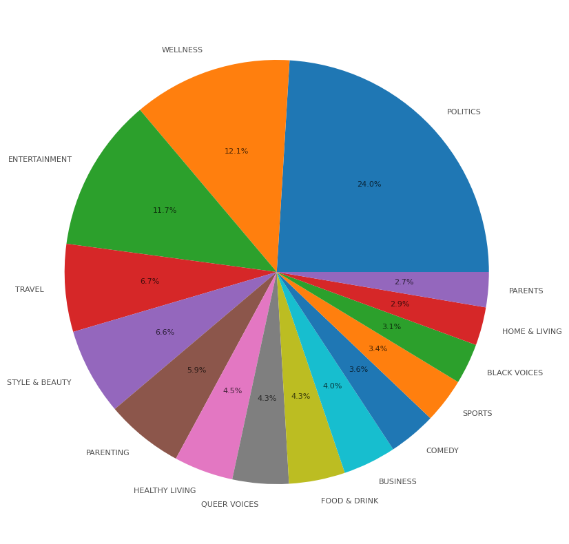

# News Category Classification with a Convolutional Neural Network (CNN)

This repository contains a project that builds, trains, and evaluates a deep learning model to classify news articles into one of 15 categories based on their headlines and short descriptions. The model uses a Convolutional Neural Network (CNN) architecture, a powerful technique for text classification tasks.

## 📋 Project Overview

The goal of this project is to automate the process of news categorization. Given a news headline and a brief description, the model predicts its most likely category (e.g., POLITICS, ENTERTAINMENT, SPORTS). This is a multi-class text classification problem addressed using Natural Language Processing (NLP) and TensorFlow/Keras.

The notebook demonstrates a complete machine learning workflow:
1.  **Data Loading & Cleaning**: Loading the dataset and performing comprehensive text preprocessing.
2.  **Exploratory Data Analysis (EDA)**: Visualizing the distribution of news categories.
3.  **Feature Engineering**: Combining text fields and preparing them for the model.
4.  **Model Building**: Designing and implementing a CNN model tailored for text data.
5.  **Training & Evaluation**: Training the model with early stopping and evaluating its performance with a detailed classification report.
6.  **Saving Artifacts**: Saving the trained model, tokenizer, and label encoder for future use.

---

## 📊 Dataset

The project utilizes the **News Category Dataset Version 3** from Kaggle, which contains news headlines from HuffPost between 2012 and 2022.

- **Source**: [Kaggle Dataset Link](https://www.kaggle.com/datasets/rmisra/news-category-dataset)
- **Original Size**: 209,527 news articles across 42 categories.
- **Preprocessing**: To manage class imbalance and focus the model, the dataset was filtered to include only the **top 15 most frequent categories**.

---

## ⚙️ Methodology

The project follows a structured approach to solve the classification problem:

### 1. Text Preprocessing
The `headline` and `short_description` columns were combined into a single text feature. A cleaning pipeline was then applied to this text, which included:
- Converting text to lowercase.
- Removing punctuation and special characters.
- Tokenizing text into individual words.
- Removing common English stopwords using NLTK.
- **Lemmatization**: Reducing words to their base or dictionary form (e.g., "running" -> "run") using `WordNetLemmatizer`.

### 2. Model Preparation
- **Label Encoding**: The 15 text-based category labels were converted into numerical format using `sklearn.preprocessing.LabelEncoder`.
- **Tokenization**: The cleaned text was tokenized using `tensorflow.keras.preprocessing.text.Tokenizer`, converting words into integer sequences. The vocabulary was limited to the top 10,000 words.
- **Padding**: All sequences were padded to a uniform length of 100 to ensure consistent input size for the model.
- **Data Splitting**: The data was split into training (80%) and testing (20%) sets, stratified to maintain the original class distribution in both sets.

### 3. CNN Model Architecture
A Sequential Keras model was built with the following layers, which is a robust architecture for text classification:
1.  **Embedding Layer**: Maps integer sequences to dense vector representations of 128 dimensions.
2.  **Dropout (0.2)**: Regularization layer to prevent overfitting.
3.  **Conv1D Layer**: A 1D convolutional layer with 128 filters and a kernel size of 5. It acts as a feature detector, identifying patterns (similar to n-grams) in the text.
4.  **GlobalMaxPooling1D**: Pools the feature maps to reduce dimensionality and capture the most important features.
5.  **Dropout (0.5)**: A second, more aggressive dropout layer for further regularization.
6.  **Dense Layer (Output)**: A fully connected layer with a `softmax` activation function to output probabilities for each of the 15 classes.

The model was compiled with the `adam` optimizer and `categorical_crossentropy` loss function. **Early Stopping** was used to monitor validation loss and prevent overfitting by stopping the training when performance on the validation set ceased to improve.

---

## 📈 Results

The model was trained for up to 20 epochs with a batch size of 64. It achieved an **overall accuracy of approximately 74%** on the unseen test data. The detailed performance for each class is shown below:
